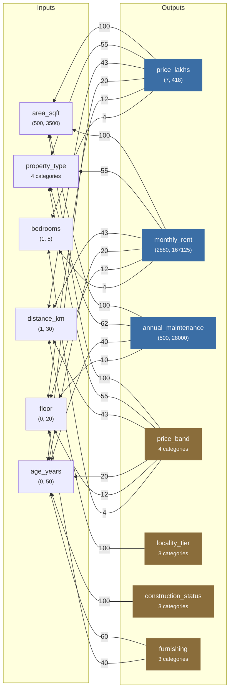
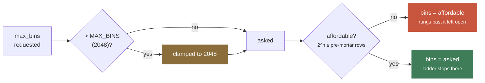
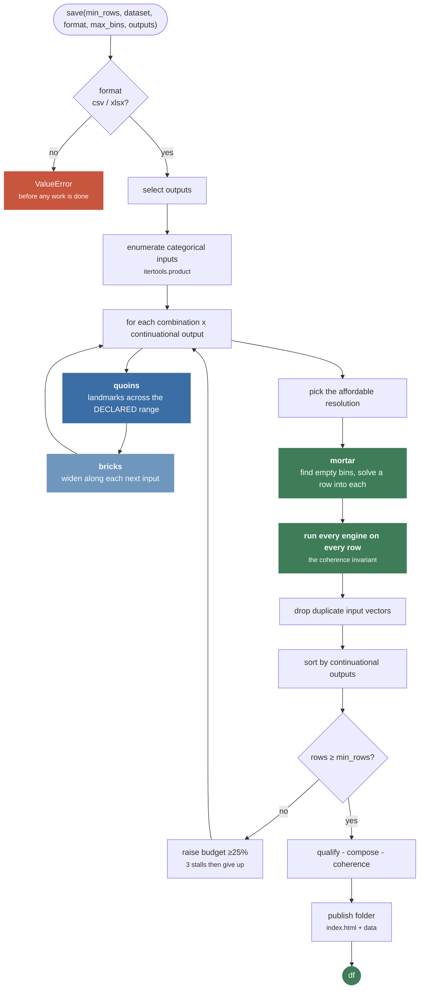
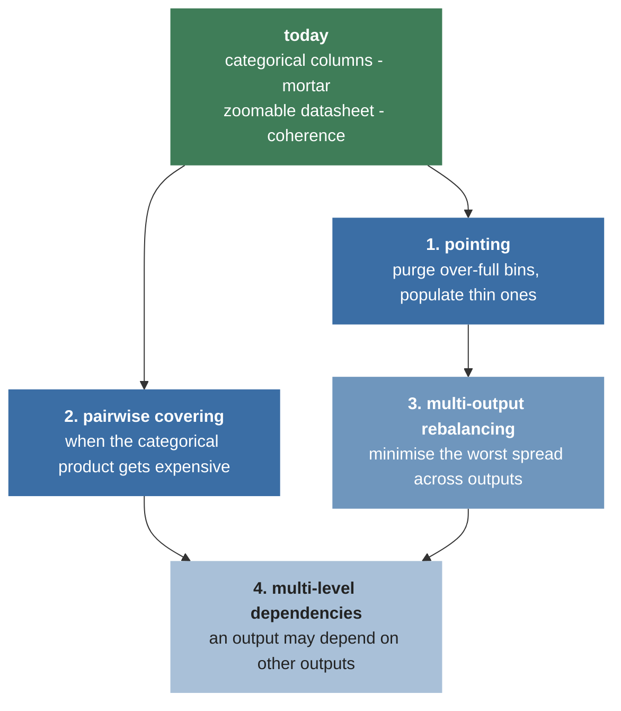
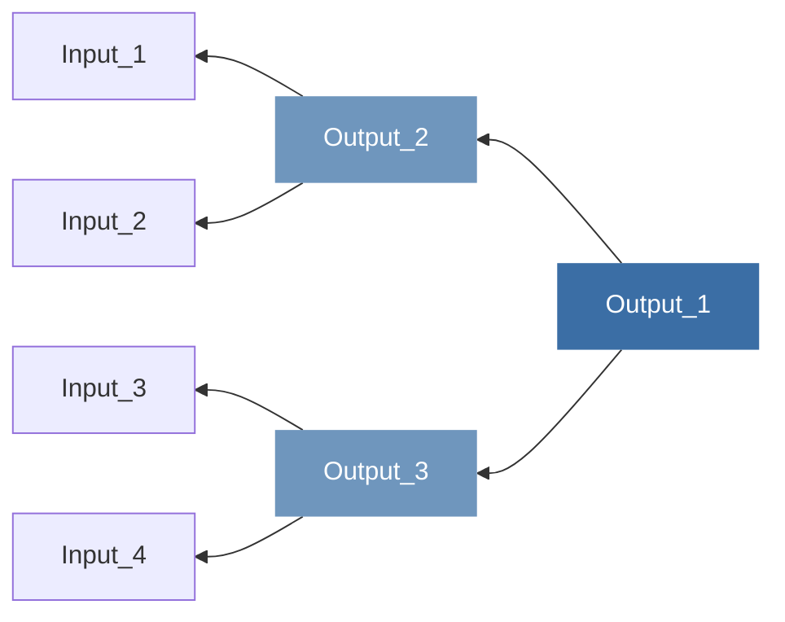

# QBMP - Quoins, Bricks, Mortar & Pointing

**Declarative synthetic dataset generation through mathematical modelling.**

Declare a math model - inputs with ranges or categories, outputs with rule functions, and the
weights that bind them - and QBMP produces a dataset that covers the whole of every output's
range, published alongside an interactive datasheet certifying exactly how well it did.

```python
data_set = Real_Estate_Pricing_Model(seed=24)
data_set.save(min_rows=1000, dataset="prices", format="csv", max_bins=2048)
```

```
Saved 4864 rows to prices/prices.csv in 6.97s
Datasheet at prices/index.html (coherent)
```

---

## Table of contents

- [The analogy](#the-analogy)
- [The three ingredients](#the-three-ingredients)
- [Two kinds of column](#two-kinds-of-column)
- [Quick start](#quick-start)
- [The model schema](#the-model-schema)
- [The two dials: scale and precision](#the-two-dials-scale-and-precision)
- [How generation works](#how-generation-works)
- [Metrics: what "good" means](#metrics-what-good-means)
- [The datasheet](#the-datasheet)
- [API reference](#api-reference)
- [Design decisions and trade-offs](#design-decisions-and-trade-offs)
- [Packaging](#packaging)
- [Roadmap](#roadmap)
- [Project layout](#project-layout)

---

## The analogy

In masonry, **quoins, bricks and mortar** are laid in that order. Quoins are the large dressed
cornerstones set first - few in number, widely spaced, and they fix the geometry of the whole
wall. Bricks fill the field between them. Mortar closes whatever gap is left, at the finest
grain of all. Once the wall stands, **pointing** goes back over the joints and finesses them.

That is exactly what a dataset generator needs to do across an output range - and the four
courses name the four operations, three of them built and the fourth on the roadmap.


The courses are genuinely different operations. Quoins and bricks are **blind** - they
subdivide on a schedule, without looking at where the gaps are. Mortar is **targeted**: it bins
the output, finds the cavities, and solves a row into each one specifically. That last step is
what turns "mostly covered" into "no gaps".

An input's **weight** decides which course it belongs to. Heavy inputs have the most leverage on
the output, so they place landmarks; light inputs perturb it only slightly, so they fill gaps.

Coverage is what the first three courses buy. **Pointing** is what will buy flatness - the fourth
letter names the aspiration, and the project is called QBMP because that aspiration is the point
of it.

---

## The three ingredients

| # | Ingredient | Where it lives |
|---|---|---|
| 1 | **Domain** per column - a range or a category list | `model["Inputs"][name]`, `model["Outputs"][name]` |
| 2 | **Weightage** - the relationship dynamics between an output and its N inputs | `model["Outputs"][name]["weights"]` |
| 3 | **Rule engine functions** - take inputs as kwargs, return the output value | a method decorated with `@rule(name)` |

The weights dict does double duty. It is the **dependency edge list** - an output connects to
exactly the inputs named in its weights - *and* it is the **sampling hierarchy**, since sorting
those inputs by weight gives the quoins -> bricks -> mortar order.



All seven outputs of [EXAMPLES/Demo.py](../EXAMPLES/Demo.py) are shown. `annual_maintenance`
names four inputs, not six, so its engine never sees the other two - and when it is generated
alone they do not appear as columns at all. `locality_tier` and `construction_status` name a
single input each, which is all the band they compute depends on.

---

## Two kinds of column

Every input and every output is exactly one of these, never both.

| | **Continuational** | **Combinational** |
|---|---|---|
| declared with | `"range": (min, max)` | `"categories": [...]` |
| values are | swept and solved | enumerated |
| as an input | probed on a grid, refined | every option visited, held fixed inside a pass |
| as an output | can drive the sampling hierarchy | **cannot** - no span to place landmarks across |
| coverage means | the span is spanned, with no gaps | every declared option appears |
| ladder splits | the declared range | the row count, into equal slices |

A combinational output rides the rows the continuational passes produce. Selecting *only*
combinational outputs raises - there would be nothing to sample against.

---

## Quick start

**Requirements:** Python 3.11+. `pandas` and `openpyxl` both install with the package -
`openpyxl` is what writes `format="xlsx"`. `numpy` arrives underneath pandas but nothing here
imports it directly. [rel_reqs.txt](../rel_reqs.txt) pins the release tooling, not the runtime.

```python
from typing import ClassVar
from QBMP.engine import QBMP, rule


class Real_Estate_Pricing_Model(QBMP):

    model: ClassVar[dict] = {
        "Outputs": {
            "price_lakhs": {
                "weights": {"area_sqft": 100, "property_type": 55,
                            "distance_km": 43, "age_years": 20,
                            "floor": 12, "bedrooms": 4},
                "range": (7, 418),
                "engine": "populate_price_lakhs",
            },
            "price_band": {
                "weights": {"area_sqft": 100, "property_type": 55,
                            "distance_km": 43, "age_years": 20,
                            "floor": 12, "bedrooms": 4},
                "categories": ["Budget", "Mid", "Premium", "Luxury"],
                "engine": "populate_price_band",
            },
        },
        "Inputs": {
            "area_sqft":     {"range": (500, 3500), "default": 1500},
            "property_type": {"categories": ["Studio", "Apartment",
                                             "Rowhouse", "Villa"],
                              "default": "Apartment"},
            "bedrooms":      {"range": (1, 5),  "default": 2},
            "age_years":     {"range": (0, 50), "default": 10},
            "distance_km":   {"range": (1, 30), "default": 10},
            "floor":         {"range": (0, 20), "default": 3},
        },
    }

    RATE_BY_TYPE: ClassVar[dict] = {"Studio": 0.90, "Apartment": 1.00,
                                    "Rowhouse": 1.10, "Villa": 1.25}

    @rule('price_lakhs')
    def populate_price_lakhs(self, area_sqft, bedrooms, age_years,
                             distance_km, floor, property_type):
        rate = (8000 - 150 * distance_km - 40 * age_years
                + 60 * floor + 100 * bedrooms)
        rate *= self.RATE_BY_TYPE[property_type]
        return round(rate * area_sqft / 1e5, 2)

    @rule('price_band')
    def populate_price_band(self, area_sqft, bedrooms, age_years,
                            distance_km, floor, property_type):
        price = self.populate_price_lakhs(
            area_sqft=area_sqft, bedrooms=bedrooms, age_years=age_years,
            distance_km=distance_km, floor=floor, property_type=property_type)
        return ("Budget" if price < 80 else "Mid" if price < 180
                else "Premium" if price < 300 else "Luxury")


if __name__ == '__main__':
    Real_Estate_Pricing_Model(seed=24).save(
        min_rows=1000,
        max_bins=2048,
        dataset="prices",
        format="csv",
        outputs=['price_lakhs', 'price_band'],
    )
```

`save()` publishes a **folder**:

```
prices/
    index.html      the datasheet
    prices.csv      the data
```

See [EXAMPLES/Demo.py](../EXAMPLES/Demo.py) for the full seven-output model.

---

## The model schema

```jsonc
{
  "Outputs": {
    "<name>": {
      "weights": { "<input>": <number>, ... },   // deps + sampling hierarchy
      "range":   (<min>, <max>),                 // continuational, OR
      "categories": ["A", "B", "C"],             // combinational - never both
      "engine":  "<method_name>"                 // must carry @rule("<name>")
    }
  },
  "Inputs": {
    "<name>": {
      "range":   (<min>, <max>),                 // continuational, OR
      "categories": ["A", "B", "C"],             // combinational
      "default": <value>                         // held here while others sweep
    }
  }
}
```

### Rules the schema must satisfy

- Every `engine` names an existing method decorated with `@rule` for **that** output. This one is
  **checked** at construction by `_bind_engines`, which raises rather than failing later.
- Every input named in a `weights` dict must exist in `Inputs`. *Not checked* - a typo surfaces as
  a `KeyError` during sampling.
- An engine's signature must accept exactly the inputs its `weights` dict names, since that dict
  is what the `@rule` wrapper builds its kwargs from. *Not checked* - a mismatch surfaces as a
  `TypeError` on the first row.
- Each `default` must lie inside that input's own domain - it is the value used for every input
  not currently being swept. *Not checked.*
- A column declares `range` **or** `categories`, never both. *Not checked* - `_combinational`
  tests for `categories` first, so a column declaring both is treated as combinational.
- Weights are relative. What matters is their **ordering** and rough ratios; deriving them from
  real leverage (`|d(output)/d(input)| x range width`, normalised so the heaviest is 100) is good
  practice.

### The `@rule` decorator

It does three things:

1. **Binds** the method to its output, so `_bind_engines` can verify the wiring.
2. **Completes the kwargs** from declared defaults, so the body always receives every input it
   depends on and never has to check for absence.
3. **Filters** out keys the output does not depend on, so a whole row can be handed to any
   engine safely.

---

## The two dials: scale and precision

```python
save(min_rows=1000,    # scaling   - how much data
     max_bins=2048,    # precision - how finely continuous it must be
     ...)
```

**`min_rows` is the continuous budget for one categorical combination**, shared among the
outputs sampled inside it. The categorical product multiplies on top, so the total lands near
`combinations x min_rows`. It is a **floor**, never an exact count - row totals are products of
per-pass counts, so the sampler lands on the closest reachable count at or above it.

**`max_bins` is the resolution mortar aims at**, and the resolution the ladder is judged at.

The two interact, and **scale wins**:



Filling N bins needs at least N rows, since a filled bin holds one. So the affordable resolution
is the largest power of two at or below the pre-mortar row count, and asking for more precision
than the scale supports is simply not satisfiable. The datasheet reports both numbers -
`resolution 512 of 2048` - so a downgrade is never silent.

`MAX_BINS = 2048` is a hard ceiling on top of that, and **readability is what sets it**: a bar on
a deeper rung falls well under half a pixel on a normal page, and an unreadable rung certifies
nothing. The solver gives out later than the eye does - measured, 8192 bins still fill clean and
only 16384 breaks down, coming back 39% empty - so the ceiling sits below the solver's own limit
on purpose, and every rung the ladder draws is one that means something. Raise the class
attribute if you are reading the numbers rather than the bars. One ceiling for every column,
deliberately - a per-column limit would have each column wanting a different bin count out of one
shared row set.

---

## How generation works

### The pipeline



### Categorical inputs are enumerated, not sampled

Categories are finite and discrete, so `_combos` takes the full cartesian product of every
combinational input and runs the continuous sampling **inside** each combination, with those
categories held fixed. That guarantees every option and every interaction between them appears.
It is the outermost loop, which is the only arrangement where every combination receives the
full continuous treatment - so a categorical's weight matters for reporting, not sampling order.

> With one categorical input the product is trivial. `_combos` is the single place a cheaper
> covering strategy would slot in - pairwise rather than full product - once enough combinational
> inputs make the product expensive.

### Quoins - landmarks on the declared range

Landmarks are placed at equidistant points across the range the model **declared**, never across
whatever a single input happens to reach. That is what keeps coverage constant as density
changes: `min_rows` sets the *interval* between landmarks, never the *span* they cover.

Targets are equidistant in **output** space, and the input value that hits each is found by a
forward sweep plus nearest-match, then narrowed by `_refine` - a shrinking re-sample window, six
rounds for 64x the grid's precision. Deliberately a re-sample rather than a bisection: it
assumes nothing about the rule function being monotonic, so non-monotonic and discontinuous
engines work unchanged.

### The residual cascade

No single input can reach the ends of an output's range. Sweeping `area_sqft` alone with
everything else at its default tops out well short of the declared maximum, which needs several
inputs at their limits at once - a *corner* of the input space.

So `_solve` cascades. The heaviest input does the coarse work; whatever residual it cannot close
because it has run to the end of its own range falls through to the next, and so on:

```mermaid
flowchart LR
    T["target<br/><b>335.0</b>"] --> A
    A["area_sqft<br/>500 &rarr; 3500"] -->|"226.8<br/>residual 108"| D
    D["distance_km<br/>10 &rarr; 1"] -->|"274.1<br/>residual 61"| G
    G["age_years<br/>10 &rarr; 0"] -->|"288.1<br/>residual 47"| F
    F["floor<br/>3 &rarr; 20"] -->|"323.7<br/>residual 11"| B
    B["bedrooms<br/>2 &rarr; 5"] --> R["<b>334.2</b><br/>reached"]

    style T fill:#8a6d3b,color:#fff,stroke:none
    style R fill:#3f7d58,color:#fff,stroke:none
    style A fill:#3b6ea5,color:#fff,stroke:none
    style D fill:#5482b0,color:#fff,stroke:none
    style G fill:#6f96bd,color:#fff,stroke:none
    style F fill:#8babcb,color:#222,stroke:none
    style B fill:#a9c0d8,color:#222,stroke:none
```



Interior targets are met by the first input alone and the rest stay at their defaults, so the
cascade costs nothing away from the extremes.

### Mortar - targeted cavity filling

Quoins and bricks never look at where the gaps actually are. Mortar does: it bins each
continuational output at the applicable resolution, finds the empty bins, and solves a row into
each one specifically.

Two things make it different from the courses above:

- **It may re-choose categories.** Some cavities sit in a range no single combination reaches -
  the top of a price range may belong to Villas alone.
- **It is given a tolerance of a quarter-bin.** The default relative `TOL` is 0.36 at a target of
  360, wider than a 2048-bin, so the cascade would otherwise stop one bin short of the cavity it
  was aiming at.

A cavity whose target is physically unreachable is **recorded, not forced** - that is what the
datasheet greys.

### Union sampling across multiple outputs

Coverage is a **union property**: rows added to span one output's range can never cost another
output its span. Uniformity is a **distribution property**: every row counts toward every
output's histogram, so flattening one necessarily reshapes the others.

QBMP takes coverage. Each continuational output gets its **own** pass, anchored to its own
declared range and ordered by its own hierarchy, and the passes are merged. Rows scale as the
**sum** over outputs, not the product.

### The coherence invariant

> **A row is only ever produced by choosing inputs and running the engines.**
> Output values are never written, interpolated, or carried across from the pass that made the
> inputs.

This is what makes merging passes safe, and what any future rebalancing must respect. Purging
rows is always legal; populating is legal only when it solves for *inputs*. `_coherence()`
re-derives every output from its own row and reports the worst disagreement - categories compare
by equality, numbers by absolute difference. It runs on every `save()` and should read `0.0`.

---

## Metrics: what "good" means

| Metric | Question it answers | Perfect |
|---|---|---|
| `covered%` | How much of the declared span did the data reach? | `100.0` |
| `solid@bins` | At what resolution does the data stop being continuous? | `= max_bins` |
| `spread` | max bin / min bin at 10 bins - how flat is it? | `1.0` (not optimised for); `inf` if any of the ten windows is empty |
| `present / declared` | How many declared categories actually appeared? | all of them |
| `coherence` | Do the outputs match what the engines say? | `0.0` |

**`covered%` alone is a trap.** It reads only the minimum and maximum, so it can report 99.9%
while the interior is riddled with gaps. `solid@bins` - the finest dyadic resolution at which no
bin is empty - is the honest blind-spot measure.

Current numbers on the example model at `min_rows=1000, max_bins=2048` (4,864 rows, 2,180 of
them laid by mortar):

```
            output       declared             achieved  covered%  solid@bins  spread
       price_lakhs       (7, 418)       (7.20, 417.81)      99.9        2048    4.79
      monthly_rent (2880, 167125) (2880.00, 167125.00)     100.0        2048    4.77
annual_maintenance   (500, 28000)  (1125.00, 26460.00)      92.1          16    9.35

             output  declared  present absent  thinnest%  fullest%
         price_band         4        4      -       12.4      44.7
      locality_tier         3        3      -       11.0      64.1
construction_status         3        3      -        8.3      76.4
         furnishing         3        3      -       11.7      64.4
```

`annual_maintenance` is deliberately declared wider than the model can produce - `(500, 28000)`
against an achievable `(1125, 26460)` - so the example demonstrates unreachable bins. Its
`solid@bins` of 16 is that showing through: a permanently unreachable bin counts as not-solid.

---

## The datasheet

Every `save()` publishes `index.html` beside the data. It is **self-contained** - inline CSS,
SVG and script, no network requests - so it opens from a `file://` path with no server, on any
machine. Light and dark themes both handled.

| Section | Contents |
|---|---|
| **Header** | model, rows, rows laid by mortar, input/output counts, resolution *asked vs granted*, seed, dataset file, timestamp - and a **download button** for each format present |
| **Input table** | every input: kind, domain, default, what it realised, which outputs it feeds and at what weight |
| **Continuational outputs** | declared vs achieved, `covered%`, `solid@bins`, thinnest, fullest, `spread` |
| **Combinational outputs** | options declared, present, absent, thinnest and fullest share |
| **Per-column cards** | collapsible; an overall panel then the ladder |
| **Footer** | coherence certificate and how to read both ladders |

### The overall panel

- **Continuational** - a density silhouette with the five-number summary (min, P25, P50, P75,
  max). The model's actual shape, not a fitted normal; these distributions are rarely symmetric
  and the skew is the point. Doubles as the zoom context.
- **Combinational** - one bar per declared option with its share. Options that never appeared
  are listed too and flagged `absent`; a category the model cannot produce is the one blind spot
  a combinational column genuinely has, and this is the only place it shows.

### The dyadic ladder

Each rung splits the axis into twice as many bins as the one above.

**Continuational** rungs split the declared range. Bar height is the row count; colour is
provenance:

| | meaning | fix |
|---|---|---|
| **blue** | laid by quoins and bricks | - |
| **green** | filled by mortar | - |
| **red** | unfilled - finer than this row count supports | raise `min_rows` |
| **grey** | unreachable - no input vector lands here | nothing; it's the model's shape |

Red and grey are different failures, and the distinction matters: red is precision the row count
did not buy, grey is output the model cannot produce at any scale.

**Combinational** rungs split the row count into equal slices, so every slice holds the same
number of rows - the height says nothing and the bar runs full depth. The signal is the mix:
each band is stacked in proportion and coloured by option, the same colours as the composition
panel above. Capped at `MAX_BANDS` (256) slices, past which a band is too narrow to show a split.

Rungs past the affordable resolution are marked `past reach`, dimmed, and left open - that
boundary is exactly what the run's row count could not buy.

### Interaction

- **Hover** any bar for a native SVG tooltip - bin ordinal, the slice of the range it covers, and
  its counts. Combinational tooltips give one line per option present. Dropped above 1024 bins,
  where a bar is too narrow to hover.
- **Drag** across any rung to zoom; **every rung in that card zooms together**, so you see one
  region at all resolutions at once. Nested drags select within the current view.
- **Drag the context panel** to pick a window from the whole range regardless of current zoom.
  Continuational cards use the density panel; combinational cards get a dedicated *whole dataset*
  band, since their composition panel is keyed to share, not position.
- **Double-click** anywhere to reset. Glass panes dim what the ladder is not showing, and the card
  header reads out the current window.

Zoom works by rewriting the SVG `viewBox` - every strip shares one `0 0 1000 30` coordinate
space, so nothing is re-rendered. The script is **purely additive**: with JavaScript blocked the
page is exactly what it is today, full-range and fully readable.

---

## API reference

### `rule(output_name)`

Decorator. Binds a method as an output's rule engine, completes its kwargs from declared
defaults, and filters out inputs the output does not depend on.

### `class QBMP`

| Class attribute | Default | Purpose |
|---|---|---|
| `model` | `{}` | The declarative math model. Override as `ClassVar[dict]`. |
| `PROBE` | `400` | Forward-sweep resolution. Raise for finer input resolution at linear cost. |
| `TOL` | `1e-3` | Relative closeness at which a target counts as met and the cascade stops. |
| `MIN_PER_BIN` | `8` | Rows a bin needs before its emptiness is meaningful; caps ladder depth when no mortar pass ran. |
| `MAX_BANDS` | `256` | Deepest combinational rung. |
| `MAX_BINS` | `2048` | Hard ceiling on `max_bins`, whatever the caller asks for. |
| `CATEGORY_COLOURS` | 8 colours | One per option, consistent between composition bar and ladder bands. |
| `SHEET_CSS` / `SHEET_JS` | - | Datasheet stylesheet and zoom script. Override to restyle. |

#### `QBMP(seed)`

Binds every engine and validates that wiring. Raises if an `engine` names a missing method, or
one not decorated with `@rule` for that output.

> **Scope of the check:** engine wiring is the only thing verified at construction. The remaining
> schema rules below are conventions the model is expected to hold to, not assertions - a weight
> naming an input that does not exist, or a `default` outside its own domain, surfaces later as a
> `KeyError` from inside a sweep rather than as an error here.

> **Note:** the pipeline is fully deterministic - grid-based, no stochastic element - so `seed`
> currently has no observable effect on output. It is threaded through for the jitter and
> per-replica variation still to come.

#### `save(min_rows, dataset, format="csv", outputs=None, max_bins=1024, bins=10, preview=10, verbose=True, datasheet=True)`

The single entrypoint: generate, qualify, check coherence, publish. Returns the DataFrame.

Publishes a folder named for the dataset:

```
<dataset>/
    index.html            the datasheet
    <dataset>.<format>    the data
```

`index.html` lets a static server resolve `<dataset>/` straight to the sheet, and keeping the
pair in one directory means the download link always points at its own data - move the folder and
both go together. `dataset` may carry a path (`"out/prices"`), and the folder is created if
absent. `format` is `csv` or `xlsx`, validated **before** any work is done.

`outputs` takes a name, a list, or `None` for all. **The first name drives the sampling
hierarchy**, and only the inputs the selection depends on become columns.

`verbose` gates the row preview and the two acceptance tables. The lines naming what was written
- `Saved N rows to ...` and `Datasheet at ...` - print either way, since they report what landed
on disk rather than how it scored. `preview` sets how many rows that preview shows and `bins` the
coarse resolution `spread` is measured at; neither touches the dataset. `datasheet=False` skips
publishing `index.html`, and with it `self.frame`.

#### `_generate(min_rows, outputs=None, max_bins=1024)`

Internal. Build and return the DataFrame without writing anything. Rows are sorted ascending by
every continuational output - what `save()` writes is exactly what this returns.

#### `_qualify(df, bins=10, outputs=None)` - `_compose(df, outputs=None)`

Internal. The two acceptance reports, continuational and combinational. Stored on `self.report`
and `self.mix` after a `save()`.

#### `_composition(df, name)`

Internal. Share of each declared option of one combinational column, absent options included.

#### `_ladder(df, output, max_bins=None)`

Internal. `[(bins, [count, ...]), ...]` at 1, 2, 4, 8 ... bins across the declared range.

#### `_provenance(df, name, bins)` - `_slices(values, bins)`

Internal. Rows per bin split by which course laid them; and composition across equal row-count
slices.

#### `_resolution(rows, max_bins)`

Internal. The finest dyadic level this many rows can fill: `min(max_bins, 2^floor(log2(rows)))`.

#### `_coherence(df, outputs=None)`

Internal. Re-derives every output from its own row's inputs; returns the worst disagreement.
Should be `0.0`. Stored on `self.drift` after a `save()`.

#### `_combinational(name)` - `_options(name)` - `_palette(name)`

Internal. Whether a column is declared with categories; its option list; and its
option->colour map.

### State left on the instance after `save()`

| Attribute | Meaning |
|---|---|
| `frame` | the published DataFrame - set while rendering the datasheet, so absent under `datasheet=False` |
| `report` / `mix` | the two acceptance reports, continuational and combinational |
| `drift` | worst coherence disagreement |
| `origin` | per-row provenance, `"bricks"` or `"mortar"` |
| `voids` | per-output set of bin indices found unreachable |
| `bins` / `asked` / `requested` | resolution granted, after the ceiling, as first asked |

---

## Design decisions and trade-offs

### Coverage was chosen over uniformity

These genuinely compete, and QBMP optimises for coverage. `spread` on merged multi-output tables
runs 4-10. Deliberate, not an unfinished edge.

### Perfect uniformity is impossible at the extremes

The pre-image of an extreme output is a *corner* of the input space; the pre-image of a mid-range
output is a large manifold. Sampling 200,000 uniformly-random input vectors puts only **27** in
the top decile - 0.014%. QBMP places around **1.9%** of its rows there, roughly 135x better, but
it cannot win completely: at the very top there is exactly one input vector that works.

### One row set cannot be uniform in two outputs

Union sampling fixes *coverage* for all outputs at once. It cannot fix *uniformity* - flattening
one output necessarily reshapes the others. When you need uniformity too, write one dataset per
output:

```python
for name in ("price_lakhs", "monthly_rent", "annual_maintenance"):
    data_set.save(min_rows=1000, dataset=name, format="csv", outputs=[name])
```

### `min_rows` is a floor, not a target

Row totals are products of per-pass counts, so exact counts are not reachable. `_plan` grows the
counts as evenly as it can - balance is what keeps the mixed-radix tiling even - then takes one
final step past the floor by whichever pass overshoots least.

Saturated landmarks collapse onto input vectors already present and get dropped, so the planned
product overstates what lands. `generate` escalates the budget by at least 25% per attempt and
gives up after three stalls, past which the model has no further distinct rows to give.

### Declared ranges are not validated against achievable ones

This is a feature. `annual_maintenance` declares `(500, 28000)` against an achievable
`(1125, 26460)`, and the datasheet greys the difference rather than hiding it. A declaration
wider than the model can produce is worth *seeing*, not silently correcting.

### The opposite case - declared *narrower* than achievable - is not surfaced

Every binning path filters on `lo <= value <= hi`: `_cavities`, `_provenance` and the density
panel skip anything outside the declared range, and `_ladder` cuts on edges derived from it, so
`pandas` drops the strays as `NaN`. Rows outside a declared range are therefore written to the
dataset in full but counted nowhere on the datasheet, and `covered%` - computed as
`(high - low) / (hi - lo)` on the achieved extremes - reads **above 100** rather than flagging
anything.

The asymmetry is not principled, it is just where the work stopped: the wider-than-achievable
case had a demonstrator in the example model and the narrower one did not. Declaring a range at
least as wide as the model can produce is the assumption the whole ladder rests on, and until
that is checked at construction, `covered% > 100` in the report is the signal to look for.

### The datasheet carries a script now

Drag-to-zoom needs it - CSS has no drag primitive. It is inline, classic (no modules, no
`fetch`), and purely additive, so a blocked script costs the zoom and nothing else. `file://`
still works with no server.

---

## Packaging

### The name

`qbm` was already taken on PyPI - by a *quantum Boltzmann machine* library, active and in the
same broad field, so the collision is real rather than theoretical. **QBMP** avoids it: the
string is distinct enough that a search finds only this project.

| | | why |
|---|---|---|
| distribution | `QBMP` | registered on PyPI; case and separators normalise under PEP 503, so `pip install qbmp` resolves to it |
| import | `QBMP` | matches the distribution, so there is nothing to remember |
| base class | `QBMP` | what users subclass - `from QBMP.engine import QBMP, rule` |
| module | `SRCS/QBMP/engine.py` | one module inside the package today; more join it as they earn splitting out |

The **P** is *Pointing*, and it means that from the start - it names the roadmap's first item,
not a placeholder to be redefined later. An acronym's expansion is documentation; changing it
after release splits your own docs.

### What ships today

Packaging is a `setup.py` with `package_dir={"": "SRCS"}`, so the `SRCS/` prefix is a source
layout convention and never appears in an import:

```python
setup(
    name="QBMP",
    version="0.0.2",
    packages=["QBMP"],
    package_dir={"": "SRCS"},
    license="GPL-3.0-or-later",
    python_requires=">=3.11",
    install_requires=["pandas>=3.0.5", "openpyxl>=3.1.5"],
    extras_require={"dev": ["pytest >= 3.7", "check-manifest", "twine"]},
)
```

`SRCS/QBMP/__init__.py` carries only the version, read from installed distribution metadata via
`importlib.metadata`. It deliberately re-exports nothing, so `QBMP` the package and `QBMP` the
class never shadow each other - the class is always reached as `from QBMP.engine import QBMP`.

> **Version lives in `setup.py` alone.** `__version__` reads what is *installed*, not what is in
> the tree, so a working copy edited past its last `pip install` will report the older number
> until it is reinstalled. Bump `setup.py` and reinstall together.

### Open packaging decisions

These are known and deliberate to leave open; none of them block the library from working.

- **`pandas>=3.0.5` is a hard floor.** Nothing in `engine.py` needs pandas 3 - it uses `cut`,
  `value_counts`, `drop_duplicates`, `sort_values`, `to_csv`, `to_excel`, all long-stable. The
  floor is worth lowering to something like `pandas>=2.0` before release, so the library does not
  fight its dependents over a version many environments do not yet have.
- **`openpyxl` is a hard dependency, not an extra.** Only `format="xlsx"` needs it, so it could
  live behind `pip install QBMP[excel]`. Shipping it unconditionally is the simpler promise and
  is what the README documents; moving it later is a breaking change for anyone writing xlsx.
- **No `pyproject.toml`.** `setup.py` builds fine, but a `[build-system]` table is what modern
  frontends expect, and setuptools is heading that way. It is also what would let the licence be
  declared as a PEP 639 expression: `license="GPL-3.0-or-later"` in `setup.py` emits the legacy
  `License:` metadata field, and the kwarg that emits `License-Expression:` is
  `license_expression=`, which exists only in setuptools >= 77 - on anything older it is an
  unknown option, warned about and dropped, leaving the sdist with **no** licence metadata. A
  `pyproject.toml` pinning `requires = ["setuptools>=77"]` is what makes that safe to adopt.
  Until then, the SPDX string on `license=` is the declaration, and **no**
  `License :: OSI Approved :: ...` classifier goes with it - setuptools >= 77 deprecates those
  and warns on every build.
- **No `MANIFEST.in`,** though `check-manifest` sits in the `dev` extra. The sdist currently
  carries `README.md`, `LICENSE.txt`, `setup.py` and the two source files - `DOCS/`, `EXAMPLES/`
  and `IMGS/` are not in it. The README's images are absolute GitHub URLs, so the PyPI page
  renders regardless.
- **No tests.** The `dev` extra declares `pytest` and [.gitignore](../.gitignore) reserves
  `TESTS/res_files/*`, but nothing is written yet. The coherence check inside every `save()` is
  the closest thing to a live assertion.
- **Pin loosely.** [rel_reqs.txt](../rel_reqs.txt) pins the release tooling for reproducing *this*
  environment; a library declares floors, not pins, or it will fight its dependents.
- **`numpy` is not a direct dependency** - pandas pulls it in, and nothing in the package imports
  it. Leave it out.
- **Exclude generated output.** [EXAMPLES/.gitignore](../EXAMPLES/.gitignore) covers
  `dataset_*`, so the published folders never enter the repo.

### Checklist

```bash
python -m pip install --upgrade build twine
python -m build                      # sdist + wheel into dist/
python -m twine check dist/*         # metadata and README render
python -m twine upload --repository testpypi dist/*
pip install --index-url https://test.pypi.org/simple/ QBMP
python -c "from QBMP.engine import QBMP, rule; print('ok')"
python -m twine upload dist/*        # the real thing
```

Delete `dist/` and `SRCS/QBMP.egg-info/` before building - both are gitignored, and a stale
egg-info carries the previous version's metadata into the new sdist.

---

## Roadmap



### 1. Pointing - the fourth course

The **P** in QBMP. Coverage is solved; flatness is not. Use the ladder to see the natural
distribution, then go back over it: **purge** rows from over-full bins, **populate** the thin ones.
Purging is the trivial half - a sort and a slice. Populating is the work. Three ways to find
them, cheapest last - rejection sampling, constrained solve into a corner-biased sub-box, or a
level-set walk from a row already in the bin.

**Rebalance fine, validate coarse** - otherwise the metric becomes self-fulfilling. Flat at 10
bins can still be lumpy at 100.

**Known ceiling:** discrete inputs cap this. `bedrooms` currently takes values like `1.34`, which
is physically nonsense - it wants to be an integer 1-5. Once inputs are genuinely discrete the
pre-image of an extreme bin may hold only a handful of legal points, and filling will fail on
exactly the bins that need it most.

### 2. Pairwise covering for categoricals

The full product is fine at one combinational input and unaffordable at five. A pairwise covering
array guarantees every option and every *pair* of options while growing logarithmically rather
than multiplicatively. `_combos` is the single place it slots in.

### 3. Multi-output rebalancing

Minimise the *worst* spread across the selected outputs rather than perfecting any single one.
Expect 2-4x, not 1.0.

### 4. Multi-level dependencies

Let a `weights` key name another output, turning the bipartite graph into a DAG:



The recursion is the easy part - `_solve` already cascades, and an intermediate output is just a
prefabricated panel with its own internal courses. Four things that will bite:

1. **Shared inputs across sibling branches.** If `Output_2` and `Output_3` both depend on
   `Input_1`, the branches are coupled and cannot be solved independently. This decides whether
   the feature is easy or hard, and should be settled first.
2. **Reachable ranges compose bottom-up.** `Output_1`'s achievable range depends on its children's
   *achievable* ranges, not their declared ones - and that error compounds at every level.
3. **Cycle detection** at bind time, with a readable error.
4. **Row budget** must be distributed across the DAG's leaves rather than a flat tier list.

---

## Project layout

```
setup.py                        packaging metadata - the single source of the version
rel_reqs.txt                    pinned release tooling (a library declares floors, not pins)
LICENSE.txt                     GPL-3.0
README.md                       the PyPI page and the short tour

SRCS/
    QBMP/
        __init__.py             __version__, read from installed distribution metadata
        engine.py               the engine - QBMP base class, @rule, datasheet renderer

EXAMPLES/
    Demo.py                     Real_Estate_Pricing_Model - a worked seven-output model
    Win_Example.bat             puts ../SRCS on PYTHONPATH, then runs the script named
    .gitignore                  keeps the published dataset_* folders out of the repo
    dataset_size_*/             published output, one folder per run (gitignored)
        index.html
        dataset_size_*.csv|xlsx

DOCS/
    Functional_Requirements.md  this file
IMGS/                           screenshots the README links to
```

Running the examples needs no install - `Win_Example.bat` exists only to put `../SRCS` on
`PYTHONPATH`:

```bash
cd EXAMPLES
Win_Example.bat Demo.py          # Windows
PYTHONPATH=../SRCS python Demo.py  # anywhere else
```
